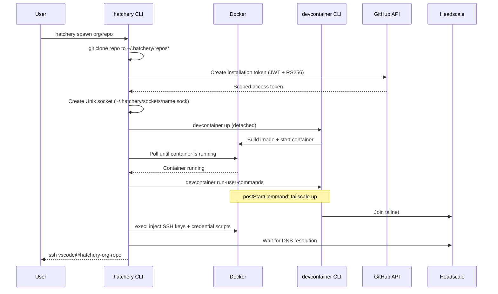
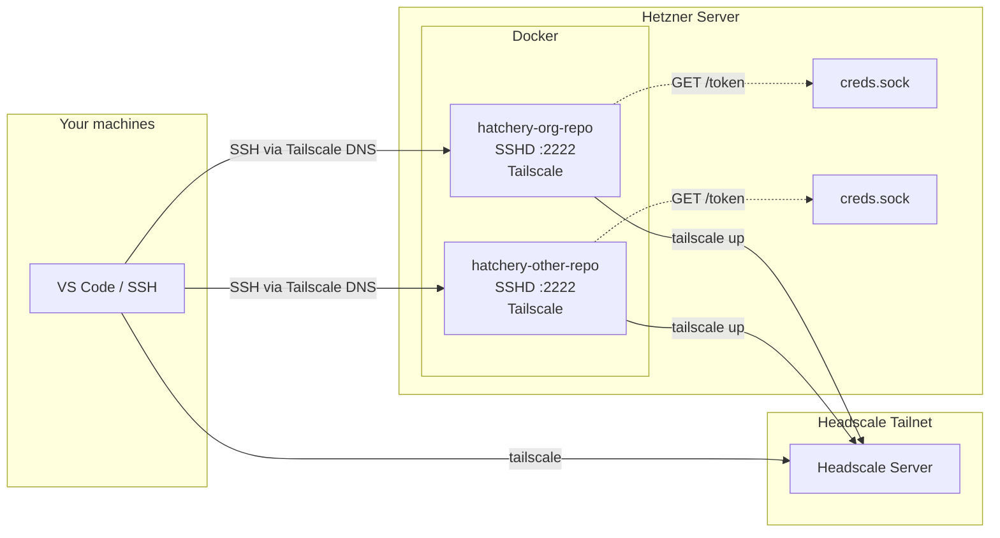
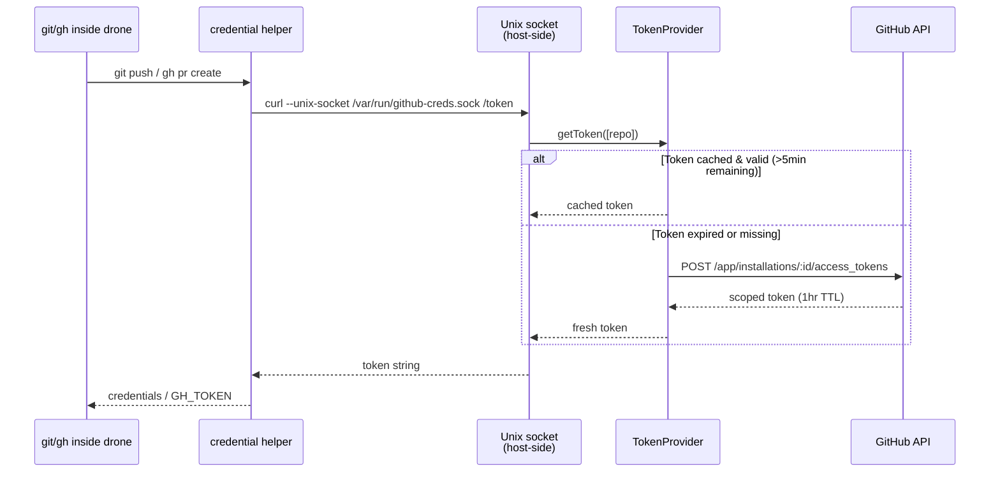

# Hatchery

Self-hosted remote dev environment manager. Runs devcontainers ("drones") on a server, connects them to your Headscale/Tailscale network, and provides scoped GitHub credentials per drone.

## Why

- Develop across multiple machines without syncing state — Docker is the source of truth
- Each drone gets its own short-lived GitHub token scoped to specific repos (no SSH key forwarding, no manual PATs)
- Works with VS Code, JetBrains, Neovim, terminal SSH — anything that speaks SSH
- Repos stay portable — same `devcontainer.json` works in Codespaces or locally

## How It Works

### Spawn Flow



### Networking

Each drone joins the Headscale tailnet as its own node. From any machine on the tailnet, drones are reachable by hostname — like any other machine on the network. No port forwarding, no tunnels.



### Scoped GitHub Credentials

A GitHub App generates short-lived installation tokens scoped to specific repos. Each drone gets a Unix socket that serves tokens on demand. Inside the container, a git credential helper and `gh` CLI wrapper call the socket transparently.



## CLI Commands

| Command | Action |
|---|---|
| `hatchery spawn <org/repo>` | Clone, build, and start a drone |
| `hatchery spawn <local-path>` | Spawn from a local directory |
| `hatchery list` | List all drones |
| `hatchery status <org/repo>` | Show drone details |
| `hatchery burrow <org/repo>` | Stop a drone |
| `hatchery unburrow <org/repo>` | Start a stopped drone |
| `hatchery slay <org/repo>` | Remove a drone permanently |

## Repo Requirements

Repos that want to work with Hatchery need this in their `devcontainer.json`:

```json
{
  "features": {
    "ghcr.io/devcontainers/features/sshd:1": {},
    "ghcr.io/tailscale/codespace/tailscale": {}
  },
  "containerEnv": {
    "HATCHERY_TS_AUTH_KEY": "${localEnv:HATCHERY_TS_AUTH_KEY}",
    "HATCHERY_TS_HOSTNAME": "${localEnv:HATCHERY_TS_HOSTNAME}",
    "HATCHERY_TS_LOGIN_SERVER": "${localEnv:HATCHERY_TS_LOGIN_SERVER}"
  },
  "postStartCommand": "sudo tailscale up --login-server=${HATCHERY_TS_LOGIN_SERVER} --authkey=${HATCHERY_TS_AUTH_KEY} --hostname=${HATCHERY_TS_HOSTNAME}"
}
```

Everything else (labels, socket mounts, SSH keys, credential scripts) is handled by hatchery at spawn time.

## Setup

```bash
cp .env.example .env              # fill in values
cp config.example.json config.json  # add GitHub App installation IDs
npm install
npm run hatchery -- spawn org/repo
```

### SSH Config

```
Host hatchery-*
  User vscode
  Port 2222
```

## Stack

- TypeScript (Node.js with `--experimental-strip-types`)
- `@devcontainers/cli` for container lifecycle
- `dockerode` for Docker API
- Headscale/Tailscale for mesh networking
- GitHub App for scoped credentials
