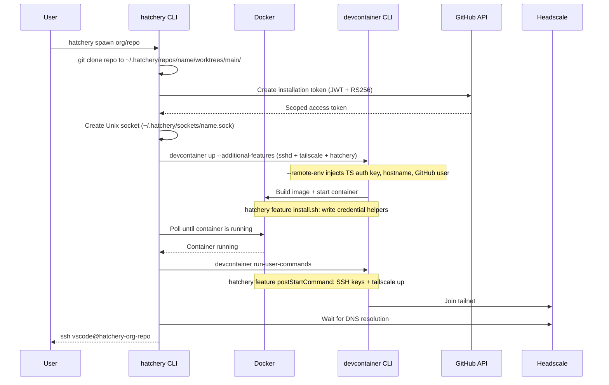
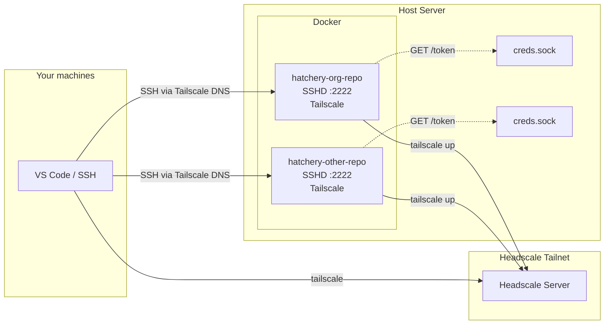
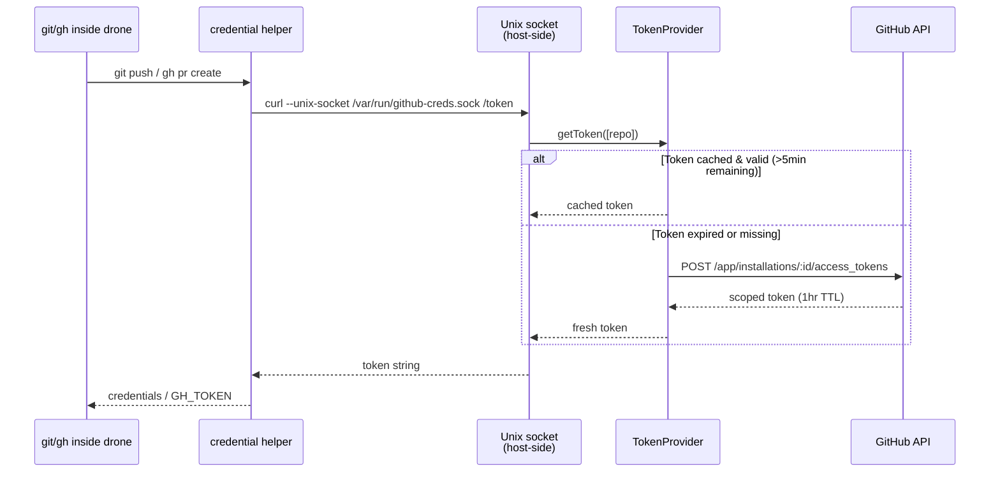

# Hatchery

Self-hosted remote dev environment manager. Runs devcontainers ("drones") on a server, connects them to your Headscale/Tailscale network, and provides scoped GitHub credentials per drone.

## Why

- Develop across multiple machines without syncing state — Docker is the source of truth
- Each drone gets its own short-lived GitHub token scoped to specific repos (no SSH key forwarding, no manual PATs)
- Works with VS Code, JetBrains, Neovim, terminal SSH — anything that speaks SSH
- Repos stay portable — same `devcontainer.json` works in Codespaces or locally
- Git worktree support — create multiple worktrees inside a drone, all persisted on the host

## How It Works

### Spawn Flow



### Networking

Each drone joins the Headscale tailnet as its own node. From any machine on the tailnet, drones are reachable by hostname — like any other machine on the network. No port forwarding, no tunnels.



### Scoped GitHub Credentials

A GitHub App generates short-lived installation tokens scoped to specific repos. Each drone gets a Unix socket that serves tokens on demand. Inside the container, a git credential helper and `gh` CLI wrapper call the socket transparently.



### Git Worktree Support

Hatchery mounts the `worktrees/` directory into the container, enabling `git worktree` usage where all worktrees are persisted on the host.

```
~/.hatchery/repos/<drone-name>/
└── worktrees/           # mounted as --workspace-folder
    ├── main/            # git clone (initial working tree, has .git/)
    ├── feature-branch/  # git worktree (created inside container)
    └── bugfix/          # git worktree
```

Inside a drone, create worktrees relative to the main clone:

```bash
cd /workspaces/main
git worktree add ../feature-branch feature-branch
```

The worktree lives alongside the main clone on the host filesystem, surviving container restarts.

## CLI Commands

| Command | Action |
|---|---|
| `hatchery spawn <org/repo>` | Clone, build, and start a drone |
| `hatchery spawn <local-path>` | Spawn from a local directory |
| `hatchery list` | List all drones |
| `hatchery status <org/repo>` | Show drone details |
| `hatchery burrow <org/repo>` | Stop a drone |
| `hatchery unburrow <org/repo>` | Start a stopped drone |
| `hatchery slay <org/repo>` | Remove a drone permanently |

## Repo Requirements

Any repo with a `devcontainer.json` works out of the box. Hatchery automatically injects sshd, Tailscale, and a custom hatchery feature at spawn time via `--additional-features`. The hatchery feature installs credential helpers at build time and runs SSH key injection + Tailscale join via its `postStartCommand`. Repos do not need any hatchery-specific configuration. The same `devcontainer.json` works in GitHub Codespaces or local VS Code without modification.

## Setup

```bash
cp .env.example .env              # fill in values
cp config.example.json config.json  # add GitHub App installation IDs
npm install
npm run hatchery -- spawn org/repo
```

### SSH Config

```
Host hatchery-*
  User vscode
  Port 2222
```

## Stack

- TypeScript (Node.js with `--experimental-strip-types`)
- `@devcontainers/cli` for container lifecycle
- `dockerode` for Docker API
- Headscale/Tailscale for mesh networking
- GitHub App for scoped credentials
